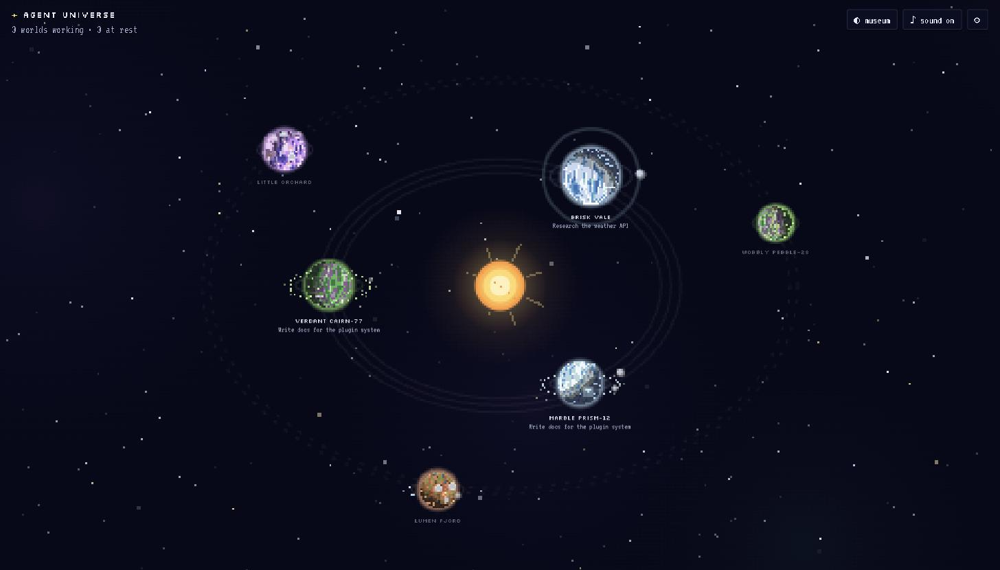
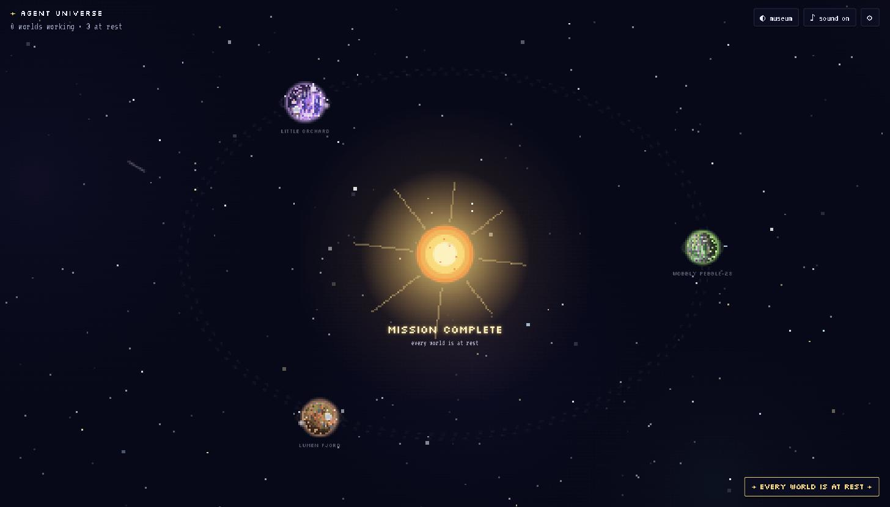

# ✦ Agent Universe

Turns your running **Claude Code agents into living pixel-art planets**.

Every Claude Code session is a world orbiting a central star. While the agent
reads, searches and builds, its civilization grows: satellites launch, huts and
factories appear, tiny citizens hop about. Errors bring lightning, meteors and
crashed UFOs. When the agent finishes its task the planet throws a party, sends a
rocket to the star and drifts out to the ring of completed worlds. When every
active world is done, the universe celebrates a **MISSION COMPLETE**.

It is a cozy companion to keep open on a second screen, not a dashboard.





```
npm install
npm run hooks:install     # once: connects Claude Code to the universe
npm run dev               # → http://localhost:4243
```

---

## 1. Starting the application

Requirements: Node 22.13+ (uses Node's built-in SQLite, no native builds).

| Command | What it does |
| --- | --- |
| `npm run dev` | Starts the event server (port 4242) and the Vite UI (port 4243) with hot reload. |
| `npm run build` + `npm start` | Production build; the server then serves the UI itself at http://localhost:4242. |
| `npm run typecheck` | Type-checks server and client. |

Ports can be changed with `AGENT_UNIVERSE_PORT` (server) — the hook script reads
the same variable.

## 2. How Claude Code connects

Claude Code has a [hooks system](https://code.claude.com/docs/en/hooks): shell
commands it runs on lifecycle events, with a JSON payload on stdin. Agent
Universe installs one tiny, dependency-free hook script for these events:

`SessionStart · UserPromptSubmit · PreToolUse · PostToolUse · PostToolUseFailure · Notification · SubagentStart · SubagentStop · Stop · SessionEnd`

```
npm run hooks:install      # writes into ~/.claude/settings.json (backup kept next to it)
npm run hooks:uninstall    # removes them again
```

The hooks are registered as `async` with a short timeout, and the script
(`hooks/agent-universe-hook.mjs`) exits silently if the app is not running, so
Claude Code is never slowed down or blocked. Because they live in your user
settings, **every** Claude Code session on the machine reports in, whatever
project it is in. The UI shows a "connect claude code" button until hooks are
detected.

Headless runs (`claude -p …`) report too. Subagents report under their parent
session and show up as scout ships.

## 3. How events are received

```
Claude Code ──hook──▶ hooks/agent-universe-hook.mjs ──POST /api/hook──▶ server
                                                                          │
                              adapters/claudeCode.ts (normalize)          │
                              universe.ts (planet state + status)         │
                              db.ts (SQLite)                              │
                                                                          ▼
                                                     browser ◀── SSE /api/stream
```

The server never exposes raw hook payloads to the UI. It normalizes them into
`UniverseEvent`s (`server/src/shared/types.ts`): `file_read`, `file_created`,
`file_modified`, `command_started/completed/failed`, `test_started/passed/failed`,
`install`, `commit`, `subagent_*`, `error`, `waiting`, `turn_completed`,
`session_ended`, … Other agent runtimes can post normalized events straight to
`POST /api/events`.

Bash commands are classified by regex (tests, installs, commits, pushes) and
their exit codes decide success or failure. `Write` becomes `file_created` or
`file_modified` depending on whether the file already exists.

## 4. How multiple agents are detected

Every hook payload carries Claude Code's `session_id`; each distinct id becomes
one planet, keyed forever by that id (its seed is a hash of it, so the same
session always gets the same world). `cwd` gives the project. There is no limit
on concurrent sessions — the layout spreads worlds over one or two orbits and the
camera zooms out to fit.

Status is derived from what actually happens, never from a fake percentage:

| Status | Derived from |
| --- | --- |
| spawning | SessionStart, nothing else yet |
| exploring | reads / searches / web / subagents |
| building | edits / writes / shell / tests / installs |
| thinking | prompt received, planning tools |
| waiting | Notification asking for permission or input (blinking beacon) |
| trouble | failed command / test / tool while damage is high |
| resting | Stop hook: the agent finished the task it was given → celebration, moves to the outer ring. A new prompt brings it back. |
| completed | SessionEnd |
| offline | no signal for `lost contact after` minutes (settings) |

## 5. Resetting the universe

- In the app: ⚙ settings → *reset the universe…* (asks for confirmation).
- From the terminal with the server stopped: `npm run reset` deletes the database.
- A single world: click it → *details* → *remove this world*.

## 6. Sound

Sound is synthesized with Web Audio (no audio files). Toggle it with the
**♪ sound** button in the top right or in settings, where volume also lives. Every
sound category has a cooldown and slight pitch variation, so a busy agent stays
pleasant for hours. Browsers require one click on the page before audio can play.

## 7. Where local data is stored

Everything is local: `data/universe.db` (SQLite: sessions, planet state, events,
missions, config). Delete it to start over. Start the server with
`AGENT_UNIVERSE_LOG_HOOKS=1` to also append every raw hook payload to
`data/hooks.log` (handy when tuning the adapter). Hook configuration lives in
`~/.claude/settings.json`, with a backup at `~/.claude/settings.json.agent-universe.bak`.

---

## Trying it without Claude Code

⚙ settings → **playground** lets you launch mock agents, cause trouble, and
finish them. Mocks go through the exact same hook adapter as real sessions.

## Customizing the universe

- **Event → planet growth** (persistent): `server/src/mappings.ts` — one table
  of reactions (`energy`, `activity`, `vegetation`, `population`, `satellites`,
  `damage`, which structures to build, …) plus per-personality biases.
- **Event → on-screen effects** (transient): `client/src/universe/reactions.ts` —
  lightning, meteors, UFOs, scanner rings, fireworks, rockets.
- **Planet looks**: `client/src/universe/palette.ts` (world types) and
  `surface.ts` (terrain generation), `sprites.ts` (tiny pixel sprites).
- **Sounds**: `client/src/audio/sound.ts`.

Settings (⚙): sound, volume, animation intensity, planet density, visual quality
(pixel size), labels, completion effects, stale timeout.

See `docs/ARCHITECTURE.md` for the design.
